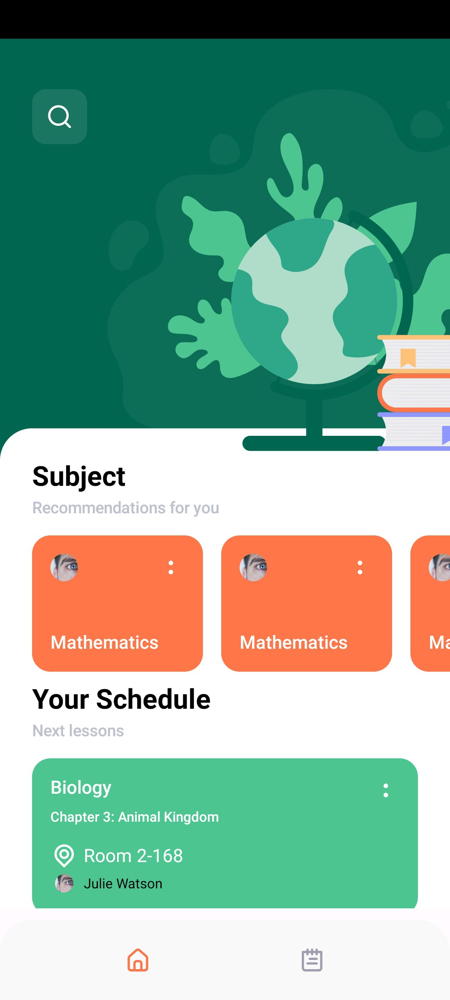
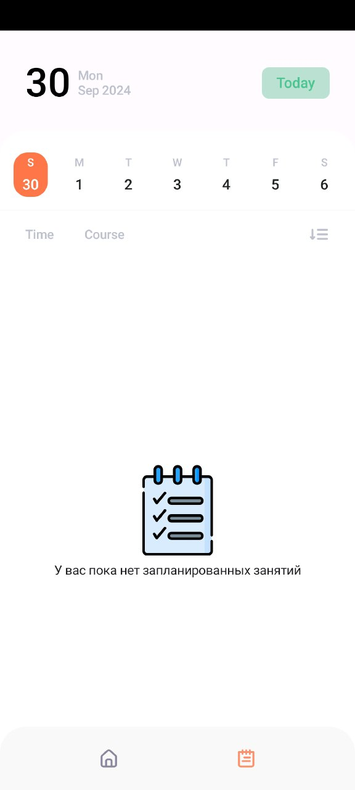
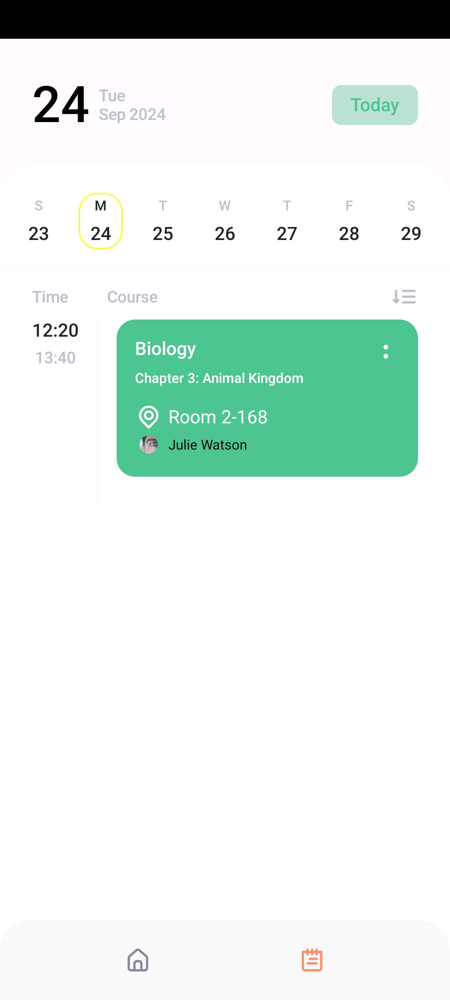

## EduStudy
The mobile application is designed for those who value their time and want to be always aware of their schedule. Easily track the dates and times of your classes to make sure no important event goes unnoticed. 
## Architecture
This application follows the classic SOLID based clean architecture approach. This approach differs from official architecture guidance, but it is actively used by many developers.
## Features
- Koin for DI
- Realtime DataBase Firebase 
- Coil for images and gifs
- Compose
- MVI 
## Screens 
**mobile application layout in Figma (https://www.figma.com/design/Vk3wkNf6XQNaOHHHp9vm2J/Schedule-Management-Platform-(2019)-(Community)?node-id=0-1&node-type=canvas&t=zkBQBphemIFbwe7d-0)**
### MainScreen 

### NotesScreen

### NotesScreen

